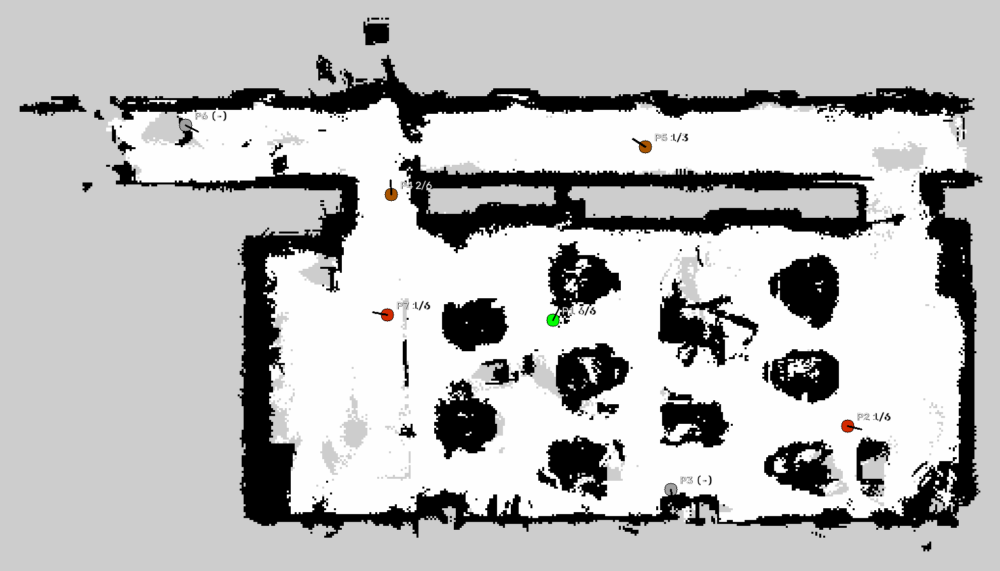

# Camera-Only RTAB-Map Relocalization Reliability

How reliably can a robot recognize where it is, from a **camera-only** RTAB-Map
database, when the environment has changed since mapping?

This repository holds the experiment: the camera-only launch configuration, an
automated measurement harness, the recorded trial data, and the aggregation that
turns it into a result.

**Platform:** AgileX LIMO Pro · NVIDIA Jetson Orin Nano · Ubuntu 22.04 ·
ROS 2 Humble · Orbbec Dabai DC1 RGB-D camera. **No LiDAR is used** for mapping or
localization.

---

## Tech stack

- **RTAB-Map** (`rtabmap_slam`, `rtabmap_sync`) in RGB-D visual mode
- **ROS 2 Humble**, **Nav2** for driving between measurement points
- **rclpy**, `tf2_ros`, `nav2_msgs` action client, `rtabmap_msgs`
- **Python 3** with OpenCV / NumPy for aggregation and map rendering
- SQLite — RTAB-Map's map database format, queried directly for integrity checks

Camera-only operation is configured in the launch files:

```
--Reg/Strategy 0        visual registration by feature matching, not ICP
--Grid/Sensor 1         occupancy grid built from the depth camera
--Grid/3D true          3-D grid so ground is segmented by surface normals
subscribe_scan: false   no /scan input at all
```

---

## What is being measured

RTAB-Map does not localize like AMCL. There is no particle cloud converging —
either a **visual loop closure** matches the current view against the database or
it does not. So the question is binary and time-dependent: *does
`/rtabmap/localization_pose` get published, when, and is it right?*

**Verdicts:**

| Verdict | Definition |
|---|---|
| Success | First published pose is within **0.5 m and 30°** of ground truth |
| False positive | A pose was published, but outside tolerance |
| No convergence | Nothing published before the 60 s timeout |

**Two-phase protocol, 60 s per trial:**

- **Phase A (0–20 s)** — robot stationary
- **Phase B (20–60 s)** — slow rotation in place, if still unconverged

Phase B exists because RTAB-Map only stores the viewpoints it drove past during
mapping. If a measurement point faces a different direction than the mapping run
did, the robot must rotate to find that viewpoint.

Localization must also be forced to retry while stationary, which is not the
default:

```
--RGBD/LinearUpdate 0     otherwise loop closure is only attempted after motion,
--RGBD/AngularUpdate 0    making Phase A unmeasurable
```

**Ground truth comes from floor tape, not from the robot.** Points are marked
with tape and their coordinates registered once, while convergence was known-good.
The alternative — snapshotting the robot's own belief at trial start — is circular:
the system under test would be defining its own answer, and a trial that started
with a wrong belief would be recorded as a 0 cm "success". Both are logged
(`truth_src`, `snap_*` columns) so the sensitivity can be shown, but only the tape
coordinates are used for verdicts.

---

## Node structure

Three launch files, each a camera-only variant:

| Launch file | Purpose |
|---|---|
| `camera_only/limo_rtabmap_bringup_camera_only.launch.py` | Base, camera, EKF odometry |
| `camera_only/limo_rtabmap_mapping_camera_only.launch.py` | Mapping — builds the database |
| `camera_only/limo_rtabmap_navigation_camera_only.launch.py` | Localization + Nav2 on the saved map |

```
/camera/color/image_raw ──┐
/camera/depth/...      ───┼─> rgbd_sync ─> rtabmap ─┬─> /rtabmap/localization_pose
odometry (EKF)         ───┘                         ├─> /rtabmap/info  (loop closure id)
                                                    └─> map -> odom TF
                                                            │
                       nav2_map_server (hand-edited nav map) ┴─> Nav2
```

A **separate hand-drawn map** (`rtab_camera_nav.yaml`) is fed to Nav2 for path
planning, because the depth camera cannot see obstacles such as thin fencing.
It does not affect relocalization — that runs purely on the RTAB-Map database.

> The navigation launch file documents its own limitation: Nav2's costmap
> obstacle layer still expects `/scan`, and with no LiDAR it receives nothing, so
> live obstacle avoidance is degraded. Speeds are kept low and runs are supervised.

### Measurement harness

`tools/auto_trial.py` is an rclpy node that runs one trial end to end:

```
(optional) drive to the point via NavigateToPose
  -> snapshot the starting pose from TF
  -> cold start the stack on a fresh copy of the map database
  -> Phase A: 20 s stationary, watching /rtabmap/localization_pose
  -> Phase B: rotate in place until 60 s
  -> classify against tape ground truth -> append a row to results.csv
```

```bash
python3 tools/auto_trial.py --point P3 --condition C1 --trial 1
python3 tools/auto_trial.py --batch "P3:3,P2:3" --condition C1
python3 tools/auto_trial.py --where        # print current belief vs. every point
```

Automating it removed human error over dozens of repetitions, and made cold start
actually cold — the stack is fully restarted per trial rather than reset in place.

---

## Two failure modes that shaped the design

**The reference map was destroyed once, and it is not recoverable.**
RTAB-Map writes its working memory to the database **on clean shutdown, even in
localization mode**. After a `/rtabmap/reset` emptied working memory, a normal
shutdown saved that empty state over the map. The database was still 120 KB with
an intact schema and zero nodes, so the launch file's "file larger than 1 KB"
guard passed it.

Three fixes, all in this repository:

1. `tools/save_master.sh` copies the map to `~/maps/rtab_camera_master.db` and
   `chmod 444` it — RTAB-Map cannot overwrite a read-only file even if opened by
   mistake.
2. `auto_trial.py` never attaches to the master. Each trial copies it to
   `/tmp/reloc_work.db` and launches against the copy.
3. The launch file's `validate_database()` now runs
   `SELECT COUNT(*) FROM Node` instead of checking file size, and refuses to start
   on an empty map.

**A confident wrong answer is worse than no answer.** The robot standing at P1
once held a belief at P7, 4 m away, from a false loop closure against a repeating
desk-row pattern. This is exactly what the false-positive verdict category exists
to count, and why the trial harness records a `snapjump` note when a run starts
from a belief more than 0.7 m off the tape.

---

## Running

```bash
# once, right after mapping — freeze the reference map read-only
bash tools/save_master.sh

# one trial
python3 tools/auto_trial.py --point P1 --condition C1 --trial 1 --map v2.4

# aggregate into the table and figure below
/usr/bin/python3 tools/make_report.py --csv results.csv --map ../rtab_camera_v2_2.yaml
```

`demo_commands.md` holds the live demonstration procedure, including recovery
steps when the environment has changed.

---

## Results

**27 valid trials across 5 measurement points. Overall success rate 11/27 (41 %).**

Aggregated by `tools/make_report.py` from `tools/results.csv`, using tape ground
truth, excluding registration and spot-check rows:

| Point | C1 (baseline) | C3 (lights off) |
|---|---|---|
| **P1** | 3/3 (0.5 s, 3 cm) | 3/3 (0.6 s, 8 cm) |
| **P2** | 0/3 | 1/3 (0.0 s, 2 cm) |
| **P4** | 1/3 (0.0 s, 13 cm) | 1/3 (0.0 s, 7 cm) |
| **P5** | — | 1/3 (0.0 s, 6 cm) |
| **P7** | 1/3 (0.0 s, 9 cm) | 0/3 |
| **Total** | **5/12 (42 %)** | **6/15 (40 %)** |

Cells show successes/trials, with mean convergence time and mean position error.



### What the data says

**Relocalization either happens almost immediately or not at all.** All 11
successes occurred in **Phase A**: 9 of the 11 converged at the very first
observation (logged as 0.0 s) and the other two at 1.5 s and 1.7 s. Not one of the
16 failures was rescued by rotating for the remaining 40 seconds. The design
assumption behind Phase B — that rotation would find the mapped viewpoint — is not
supported by this data.

**Success is a property of the location, not of the lighting.** Turning the lights
off (C3) barely moved the aggregate: 40 % versus 42 %. But the spread between
points is large and consistent — P1 succeeded 6/6 across both conditions, while
P2 and P7 failed almost everywhere. What separates them is how distinctive the
view is and how closely it matches a viewpoint the mapping run actually drove
through.

**When it succeeds, it is accurate.** Position error across all 11 successes
ranged from 1.7 cm to 13.2 cm, far inside the 0.5 m tolerance. There is no gradual degradation: the failure mode
is silence, not drift.

**No false positives among the valid trials** — 11 successes, 16 non-convergences,
zero out-of-tolerance publications. The dangerous false positive described above
did occur, but during exploratory runs rather than inside the counted protocol.

### Caveats, stated plainly

- C2 (different time of day) and C4 (rearranged furniture) were planned but not
  measured. The table's empty columns are unrun, not zero.
- C3 was daytime lights-off with residual daylight from the windows; a night-time
  measurement would likely differ.
- Trials span map versions v2.2–v2.4. These share a coordinate frame — v2.3 and
  v2.4 are continuation-mapping additions after furniture moved — but they are not
  byte-identical maps. The `map` column in `results.csv` records which was used.
- The environment is a single lecture room. Nothing here generalizes to other
  spaces without re-measurement.

`slides/rtabmap-reliability-ku.pdf` presents these results.

---

## Repository layout

```
camera_only/          three camera-only RTAB-Map launch files
tools/
  auto_trial.py       automated per-trial measurement harness
  relocation_logger.py  earlier single-trial logger
  save_master.sh      freeze the reference map read-only
  make_report.py      aggregate results.csv -> table + map figure
  results.csv         raw trial data (every row, including excluded ones)
  points.csv          tape ground-truth coordinates
measurement_plan.md   protocol, verdict criteria, session-by-session log
demo_commands.md      live demonstration and recovery procedure
```

`measurement_plan.md` and `demo_commands.md` are kept in Korean, as written during
the sessions. The map databases themselves (`*.db`) are not tracked — they are
large binaries, and `save_master.sh` is the intended way to produce one.
